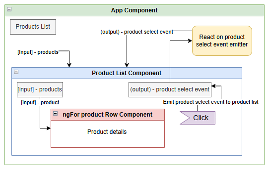

+++
author = "Safayat Borhan"
title = "Angular Parent Child Communication with (Input) and [Output]"
date = "2025-08-06"
description = "Angular Parent Child Communication with (Input) and [Output]"
tags = [
    "Angular",
    "Typescript"
]
+++

This is the high level architecture of what we are going to build now: 


product.model.ts:
```typescript
export class Product {
    constructor(
        public sku: string,
        public name: string,
        public imageUrl: string,
        public department: string[],
        public price: number
    ) {

    }
}
```

app.component.ts:
```typescript
export class AppComponent {
  products: Product[];
  title = 'inventory-app';

  constructor() {
    this.products = [
      new Product(
      "NICEHAT",
      "A nice black hat",
      "/resources/images/products/black-hat.jpg",
      ["Men", "Accessories", "Hats"],
      29.99
    ),
    new Product(
      "NICEHAT 2",
      "A nice black hat 2",
      "/resources/images/products/black-hat.jpg",
      ["Men", "Accessories", "Hats"],
      49.99
    )
    ];
  }
  
  productWasSelected(product: Product): void {
    console.log('Product clicked: ', product);
  }
}
```

app.component.html
```html
<div class="inventory-app">
  <app-product-list [productList]="products" (onProductSelected)="productWasSelected($event)"></app-product-list>
  <!-- [squareBrackets] pass inputs -->
  <!-- (parentheses) handle outputs -->
  <!-- Data flows in to our component via input bindings and events flow out of our component through output bindings. -->
</div>
```

product-list.component.ts
```typescript
export class ProductListComponent {
  @Input() productList!: Product[];
  @Output() onProductSelected!: EventEmitter<Product>;

  private currentProduct!: Product;

  constructor() {
    this.onProductSelected = new EventEmitter();
  }

  clicked(product: Product): void {
    this.currentProduct = product;
    this.onProductSelected.emit(product);
  }

  isSelected(product: Product): boolean {
    if (!product || !this.currentProduct) {
      return false;
    }

    return product.sku === this.currentProduct.sku;
  }
}
```

product-list.component.html
```html
<div class="ui items">
    <app-product-row
    *ngFor="let product of productList" 
    [product]="product" 
    (click)='clicked(product)' 
    [class.selected]="isSelected(product)"></app-product-row>
</div>
```

product-row.component.ts
```typescript
export class ProductRowComponent {
  @Input() product!: Product;
  @HostBinding('attr.class')cssClass='item';
}
```

product-row.component.html
```html
<div class="content">
    <div class="header">{{ product.name }}</div>
    <div class="meta">
        <div class="product-sku">SKU #{{ product.sku }}</div>
    </div>
</div>
```