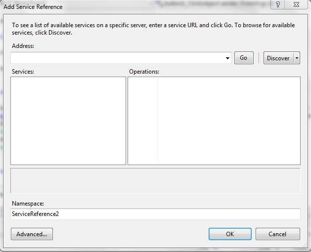

+++
author = "Safayat Borhan"
title = "ASP.NET Web Service"
date = "2015-04-18"
description = "ASP.NET Web Service From WinForm Application"
tags = [
    "ASP.NET",
    "Web Service",
    "WinForm"
]
+++

Web Services are like a door and the master key is your own property. You can use the key for any purpose you want. You will use this as you need to. Imagine you have created a web service that can provide a login and registration system. It can also insert data into a table and fetch the data with a given modified condition. You can use this web service in any platform you want. Such as, you have created a web service using ASP.NET and you want a registration and login feature for an Android application, you are obviously welcome and you can do the job with less work and coding dilemmas.

Here I have made a web service using ASP.NET 4.5 and tested this service with a C# application. In a very simple way, you just need to understand its properties and follow the procedure. I have provided the code for you.

## Step 1
Open your Visual Studio. Add a new project and select ASP.NET empty web application.

Then, in the Solution Explorer, right-click on the project name, click Add. You will find a list like web form, web API controller class and so on. Scroll down, click on the Web Service.

Name it and click add. A new window will open for writing the code for the web service. Start coding here.

## Step 2
I have made three functions here, one for registration, one for login and another for some sort of general purpose.

Be aware of “[WebMethod]” properties. It's mandatory before creating a new function. I have three functions and I have written it three times before every function. If you don't understand, download the source code that I have provided. Compile it, then if there is no syntax error, this will open. Remember, the web service extension is “.asmx”.

## Step 3
The web service has been made. Now we will test it with a C# application. I have made a simple project just for testing it. You can use and modify these things for further purposes.

Now the main criteria should be fill up. Imagine you have created a web service and a Windows Forms application. How will they work? The process is pretty straight forward. Right-click on the References tab of the Windows Forms application project in Solution Explorer, then click Add service reference. Then this pop-up window will open.

Copy the URL of the web service and paste it into the address bar. I have made it in the local server. If you upload it online, you should insert the server address of the web service. Click OK, then the service reference will be added into your project.

## Step 4
You should create an object of soap client object to get access to the web service. Then you can use the functions, you have created in the web service.

Remember, the client data will go to the web service (server) first and then after execution under those functions, the output will show. Remember about the database connection string. You should change the connection string by you PC server name.

Thank you for reading. Have a good day.

This article was previously published here before: https://www.c-sharpcorner.com/UploadFile/3bff37/Asp-Net-web-service-with-a-windows-form-application/