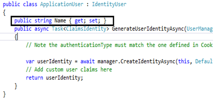
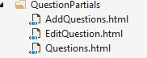

+++
author = "Safayat Borhan"
title = "CRUD with AngularJs, ASP.NET MVC 5 and Entity Framework"
date = "2017-02-17"
description = "CRUD with AngularJs, ASP.NET MVC 5 and Entity Framework"
tags = [
    "ASP.NET MVC",
    "csharp",
    "AngularJs",
    "Entity Framework",
    "CRUD"
]
+++

In this article, I will demonstrate how we can use AngularJs with ASP.net mvc. Here, we will learn about CRUD functionality by AngularJs and ASP.net mvc 5 with entity framework code first approach. We will learn some basics of asp.net identity, configure them, and very simple uses of them.

## Step 1
If we want to use angularjs in our mvc application, first we have to download the angular.js file from https://angularjs.org/. Please make sure, you are downloading the 1.2 version of angular because we will use angularjs routing here. The 1.2 version is best for single page routing. Create an asp.net mvc web application project. Copy the angular.js file to the Scripts folder of the project. Create a folder in the project and name it Angular. Add another folder in the Angular folder and name it App. We will write all the angular codes, apps and controllers here. Then add a javascript file and name it app.js. This will be the module of all angular controllers. And then make a folder here and add a javascript file named controllers.js. Now we have to add a bundle to make a connection between the angular codes with asp.net mvc 5. To do so, open BundleConfig.cs which is in the app_start folder in the project. Add a bundle like this:
```csharp
bundles.Add(new ScriptBundle("~/bundles/AngularCustom").IncludeDirectory(  
                    "~/Angulars/App", "*.js", true  
                )); 
```

The bundle name is AngularCustom and this includes all the javascript files inside the ~/Angular/App directory. Then in the _Layout.cshtml we have to add a render for this bundle at the bottom of the code. Like this:
```csharp
@Scripts.Render("~/bundles/AngularCustom")   
```

The connection between angular and asp.net mvc is ready. We can now start writing code.

## Step 2
We will use the default project of asp.net mvc, that visual studio provides us. Here, in this project, asp.net identity framework is pre-loaded. We will slightly customize it. In default register method, there are only two properties we can insert. Let’s add another property here for ‘Name’. To do so, let’s put a Name property just inside the IdentityModels.cs that is in the Models folder.


Enable migrations and update database. To do so, write in the Package Manager Console:
``` powershell
Enable-Migrations -ContextTypeName ProjectName.Models.DBContextClassName
Add-Migration 'NameFildAdded'
Update-Database
```
If you are new to the entity framework code first approach, please do some studying before proceeding. Now, the database is ready. By default, in the menu bar, it shows “Hello EmaiAddress”. We will put the name of the user in the menu written like “Hello NameOfUser”. To do so, let’s move to the HomeController class. Then put the [Authorize] keyword before the index action method. This keyword prevents the action method without performing log in. That means, if anyone is not logged in, he will not able to go to this method’s view. Rewrite the index method like this:
```csharp
public ActionResult Index()  
{  
    var emailOfUser = User.Identity.Name;  
    ApplicationUser user = new ApplicationUser();  
    user = db.Users.Where(p => p.UserName == emailOfUser).SingleOrDefault();  
    ViewBag.Name = user.Name;  
    return View();  
}   
```

Here, we are finding the Name of the current user by searching by his email address. We will pass this viewbag to the _LoginPartial.cshtml view. Rewrite the html like this:
```csharp
<ul class="nav navbar-nav navbar-right">  
    <li>  
        @Html.ActionLink("Hello "+(string)ViewBag.Name +"!", "Index", "Manage", routeValues: null, htmlAttributes: new { title = "Manage" })  
    </li>  
    <li><a href="javascript:document.getElementById('logoutForm').submit()">Log off</a></li>  
</ul>   
```

We are casting the viewbag property into string here. Identity configuration is done here. Build and run the project to check everything is okay.

## Step 3

In this step, we will write some C# and angular codes. Let’s first create a model first. For that, add a class in models folder and name it Question.cs. 
```csharp
public class Question  
{  
    public int ID { get; set; }  
    public string Title { get; set; }  
    public string Questions { get; set; }  
    public int Vote { get; set; }  
    public int View { get; set; }  
    public DateTime Date { get; set; }  
    public int Answer1 { get; set; }  
    public string AcceptedAnswer { get; set; }  
}   
```

To setup a connection between this class to database, make a dbContext class and name it VirtualClassroomDBContext.cs. 
```csharp
public class VirtualClassroom2DBContext : DbContext  
{  
    public DbSet<Question> QuestionDB { get; set; }  
}   
```

Now we have to write connection string in the web.config file. 
```csharp
<connectionStrings>  
    <add name="DefaultConnection" connectionString="Server = DESKTOP-G7GTQ5B\SQLEXPRESS; Database = VirtualClassroomV2DB; user id=sa; password=cse;" providerName="System.Data.SqlClient" />  
    <add name="VirtualClassroom2DBContext" connectionString="Server = DESKTOP-G7GTQ5B\SQLEXPRESS; Database = VirtualClassroomV2DB; user id=sa; password=cse;" providerName="System.Data.SqlClient" />  
</connectionStrings>  
```

The server is my machine server name. You have to put here your own server name as well as id and password. First things first. We will now start writing some C# code. Let’s move to HomeController and write some methods to perform crud functionality of server side. 
```csharp
VirtualClassroom2DBContext db = new VirtualClassroom2DBContext();[Authorize]  
public JsonResult GetQuestions()  
{  
    List<Question> QuestionList = new List<Question>();  
    QuestionList = db.QuestionDB.ToList();  
    return Json(new { list = QuestionList }, JsonRequestBehavior.AllowGet);  
}  

[Authorize]  
public JsonResult AddQuestion(Question question)  
{  
    question.Date = DateTime.Parse(DateTime.Now.ToShortTimeString());  
    db.QuestionDB.Add(question);  
    db.SaveChanges();  
    return Json(new { status = "Question added successfully" });  
}  

[Authorize]  
public JsonResult GetQuestionByID(int id)  
{  
    Question question = new Question();  
    question = db.QuestionDB.Where(p => p.ID == id).SingleOrDefault();  
    return Json(new { question = question }, JsonRequestBehavior.AllowGet);  
}  

[Authorize]  
public JsonResult UpdateQuestion(Question question)  
{  
    question.Date = DateTime.Parse(DateTime.Now.ToShortTimeString());  
    db.Entry(question).State = EntityState.Modified;  
    db.SaveChanges();  
    return Json(new { status = "Question updated successfully" });  
}  

[Authorize]  
public JsonResult DeleteQuestion(int id)  
{  
    Question question = new Question();  
    question = db.QuestionDB.Where(p => p.ID == id).SingleOrDefault();  
    db.QuestionDB.Remove(question);  
    db.SaveChanges();  
    return Json(new { status = "Question deleted successfully" });  
}
```

We have created five methods to demonstrate CRUD functionality. All the methods are returning json data with a particular status string. The code is pretty straight forward.

We will use angular route and partial views for insert, update and show the data. For that, let’s add a folder to the project and name it QuestionPartials. Then we have to add three empty html document for showing, inserting and updating the data. Like this:


Now let’s write some angular code in app.js file. 
```csharp
var app = angular.module("QuestionApp", ["QuestionApp.controllers", "ngRoute"]);  
  
app.config(["$routeProvider", function ($routeProvider, $locationProvider) {  
    $routeProvider          
        .when("/", { templateUrl: "QuestionPartials/Questions.html", controller: "QuestionController" })  
        .when("/addQuestion", { templateUrl: "QuestionPartials/AddQuestions.html", controller: "QuestionController" })  
        .when("/editQuestion/:id", { templateUrl: "QuestionPartials/EditQuestion.html", controller: "QuestionEditController" })  
        .when("/deleteQuestion", { templateUrl: "QuestionPartials/Questions.html", controller: "QuestionController" })  
        .otherwise({ redirectTo: "/" });  
}]);   
```

All the angular module and routing codes are written here in app.js. Please make sure that the angular route.js is linked with the document. For that, we will put the cdn link of angular routing in index.cshtml in home controller.
```csharp
<script src="//cdnjs.cloudflare.com/ajax/libs/angular.js/1.2.20/angular-route.min.js"></script>   
```

In QuestionController.js, all the factory and controllers are have to be written like this:
```javascript
angular.module("QuestionApp.controllers", [])  
.controller("QuestionController", function ($scope, QuestionService, $routeParams) {  
    $scope.message = "Message from question controller";  
  
    $scope.rowToDisplay = 10;  
    $scope.sortColumn1 = "Date";  
    $scope.reverseSort = false;  
    $scope.sortData = function (column) {  
        $scope.reverseSort = ($scope.sortColumn1 == column) ? !$scope.reverseSort : false;  
        $scope.sortColumn1 = column;  
    }  
  
    $scope.getSortClass = function (column) {  
        if ($scope.sortColumn1 == column) {  
            return $scope.reverseSort ? 'arrowDown' : 'arrowUp';  
        }  
        return '';  
    }  
    $scope.removeText = function () {  
          
    }  
  
    //Data processing with server side  
    //This is the way of fetching data from post factory  
    QuestionService.getQuestionFromDB().then(function (d) {  
        $scope.listOfQuestion = d.data.list;  
    })  
  
    $scope.addQuestionToDB = function () {  
        QuestionService.addQuestionToDB($scope.Question);   //This is why, we used Question.title and so on in AddQuestion.html  
    }  
  
    $scope.deleteQuestion = function (id) {  
        QuestionService.deleteQuestionFromDB(id);  
    }  
})  
.controller("QuestionEditController", function ($scope, QuestionService, $routeParams) {  
    $scope.message1 = "Edit page";  
    QuestionService.getQuestionByID($routeParams.id).then(function (d) {  //$routeParams.id is the id in the url  
        $scope.Question = d.data.question;  
    })  
  
    $scope.updatePlayer = function () {  
        QuestionService.updateQuestionToDB($scope.Question);  
    }  
})  
.factory("QuestionService", ["$http", function ($http, $route) {  
    var fac = {};  
  
    fac.getQuestionFromDB = function () {  
        return $http.get("/Home/GetQuestions");  
    }  
  
    fac.addQuestionToDB = function (question) {  
        return $http.post("/Home/AddQuestion", question).success(function (response) {  
            alert(response.status);  
            document.getElementById("title").value = "";  
            document.getElementById("question").value = "";  
        });  
    }  
  
    fac.getQuestionByID = function (id) {  
        return $http.get("/Home/GetQuestionByID", { params: { id: id } });  
    }  
  
    fac.updateQuestionToDB = function (question) {  
        return $http.post("/Home/UpdateQuestion", question).success(function (response) {  
            alert(response.status);  
        })  
    }  
    fac.deleteQuestionFromDB = function (id) {  
        return $http.post("/Home/DeleteQuestion", { id: id }).success(function (response) {  
            alert(response.status);  
            // $route.reload();  
        })  
    }  
  
    return fac;  
}])
```

For every action, we have made separate controllers and factories. Now you have to configure the index view of home controller and the three partial views. The code is pretty straight forward. All you need is to just download the code and configure it yourself. Please make sure, the connection string has to be matched with your server.

Project [link](https://github.com/safayatborhan/CRUDWithAngularAndAspNetMvc)

This article was previously published here before: https://www.c-sharpcorner.com/article/crud-functionality-in-angularjs-and-asp-net-mvc-5-with-entity-framework-code-fir/