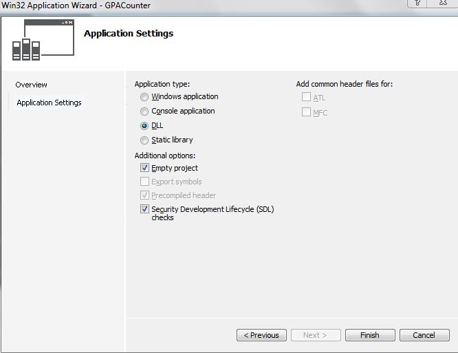
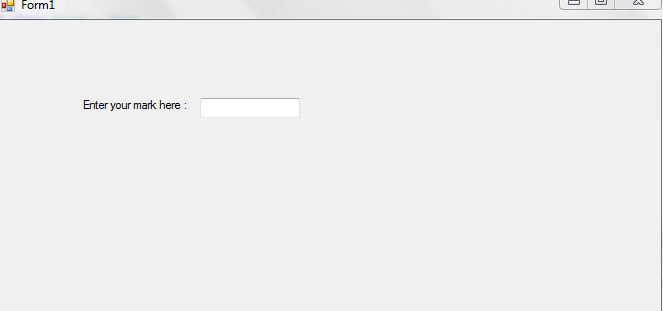
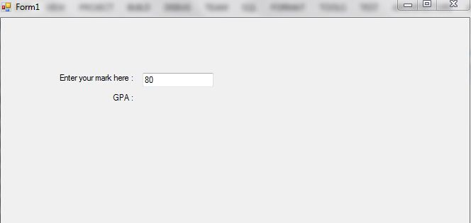
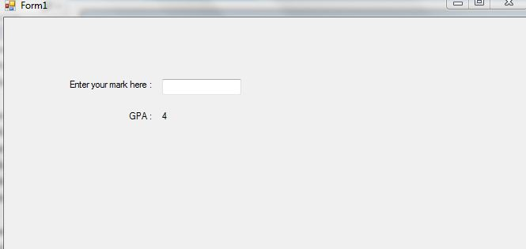

+++
author = "Safayat Borhan"
title = "Custom DLL and It's Usage"
date = "2015-04-29"
description = "Explanation of Dynamic Link Libraries (DLLs) by creating a DLL library in C++ and using it with C#"
tags = [
    "DLL",
    "WinForm",
    "C#",
    "C++"
]
+++

First of all, we need to understand what Dynamic Link Library (DLL) is. A DLL is something like a library that you make for your own purposes. Such as, in the C language, if you want to use the printf(“”) function, you must #include<stdio.h>. Which is nothing but a library and using this library, you will execute the corresponding functions. As a programmer, sometimes you need to make your own library for various purposes. You can use these libraries in every platform, every language and even every framework. DLLs are like EXEs but they are not executable. A DLL can contain functions, variables, classes, any resources(icons, images, files) and so on. It also can contains COM components and .NET libraries. A program loads a DLL at start-up, via the Win32 API load library.

So, here we have something known as a DLL library. You can make a DLL library and can it from every environment or framework as your wish. Imagine, you need to write code in C#. As far I know, C/C++ is pretty faster than C#. But, you can find a framework (.NET) in C# that can be very helpful to write the code. What if you can use both C# and C/C++ in your code? A DLL library shows its real beauty when using this for cross-platform code. You can use the framework and at the same time, you can use C/C++ for calculating a large amount of data for reducing time complexity. In that case, you must make a DLL library in C and make a relation with it in C# to get access to that DLL library.

I will make a DLL library with C++ that can execute a function called gpacounter and this function takes a number as a parameter and returns its specific GPA. So, here we go.

First of all, you need to write a DLL library making code with C++. The code is pretty straight forward. Open your Visual Studio then click New Project then select other language > Visual C++ > Win32 console application and then press OK. A new window will open. Click Next.


Here, you need to click on the DLL radio button. Otherwise a Dynamic Link Library will not be generated. Then click Finish. Then point the cursor over the project that is in the Solution Explorer. Right-click and add a new item. I mean create a new source file and name it. Remember about the extension. It must be .cpp. Then start writing code.
```C
#include < stdio.h >  
extern "C"  
{  
    __declspec(dllexport)  
    double gpacounter(double total_number)  
    {  
        if (total_number >= 80)  
        {  
            return 4;  
        }  
        if (total_number >= 75 && total_number <= 79.99)  
        {  
            return 3.75;  
        }  
        if (total_number >= 70 && total_number <= 74.99)  
        {  
            return 3.50;  
        }  
        if (total_number >= 65 && total_number <= 69.99)  
        {  
            return 3.25;  
        }  
        if (total_number >= 60 && total_number <= 64.99)  
        {  
            return 3.00;  
        }  
        if (total_number >= 55 && total_number <= 59.99)  
        {  
            return 2.75;  
        }  
        if (total_number >= 50 && total_number <= 54.99)  
        {  
            return 2.50;  
        }  
        if (total_number >= 45 && total_number <= 49.99)  
        {  
            return 2.25;  
        }  
        if (total_number >= 40 && total_number <= 44.99)  
        {  
            return 2.00;  
        } else  
        {  
            return 0;  
        }  
    }  
} 
```

Here we are exporting the DLL. So, in the third line we have written:
```C
__declspec(dllexport) 
```

This was for exporting the DLL reference. When you import this reference from C# code you will write the import string. We will learn about that now.

So, the Dynamic Link Library has been created. It has a function and I do believe you can of course understand the functionality of this function. Most of all, remember about the 2nd and 3rd lines code. These codes are necessary for making a DLL.

Now it's time for some C# code. Let's start. So, let's create a Windows Forms application and make a GUI like this:


It's pretty straight forward code here in the backend. Go to the TextBox event property. Double-click or enter in the key_down property. The code will be like this.

```csharp
namespace Reference_with_DLL  
{  
    public partial class Form1: Form  
    {  
        [DllImport("GPACounter.dll")]  
        public static extern double gpacounter(double total_number);  
        public Form1()  
        {  
            InitializeComponent();  
        }  
        private void textBox1_KeyDown(object sender, KeyEventArgs e)  
        {  
            if (e.KeyCode == Keys.Enter)  
            {  
                double gpa = double.Parse(textBox1.Text);  
                double result = gpacounter(gpa);  
                label2.Text = result.ToString();  
                textBox1.Text = string.Empty;  
                textBox1.Focus();  
            }  
        }  
    }  
}
```

Don't forget to write using System.Runtime.InteropServices.

This is for importing the DLL reference. And the import string is [DllImport("GPACounter.dll")].

And after this line, we just called the function to import. Here is this code that was in the DLL file.

Now imagine, we have made a file DLL code. But where is the DLL? Where is the DLL file that was created? Go to your DLL file making project's folder. Then go to the debug folder. You will find a file with the extension .dll. This is the file we have made. Just copy the file and paste it into the debug folder of the C# project. You are done. Test it, see how it works.



So, here we have used two languages in just one application using a Dynamic Link Library.

Thank you for reading.

Have a nice day.

This article was previously published here before: https://www.c-sharpcorner.com/UploadFile/3bff37/explanation-of-dlldynamic-link-libraries-with-creating-a-d701/