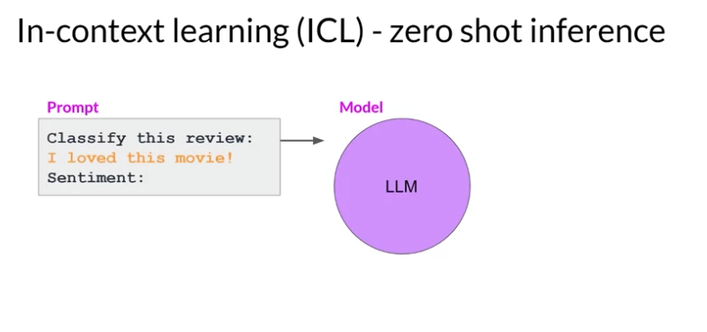

+++
author = "Safayat Borhan"
title = "Generative AI and LLMs"
date = "2025-01-11"
description = "Generative AI and LLMs"
tags = [
    "Generative AI",
    "LLM"
]
+++

# Concepts

## Large Language Model

The way we interact with LLM are different than typical programming paradigm. In programming world, we write code, use libraries. In contrast LLM are able to take *natural language* or human written instruction and perform tasks. 

**Prompt**: The text we pass as a human written form.

**Inference**: The act of generating text is known as inference.

**Context Window**: The space or memory that is available to the prompt. Usually limited to few thousands words but that depends on model.

**Completion**: The output.

## Transformers
Generative algorithms are not new. There was an algorithm before called **Recurrent Neural Network**(RNN). It was mainly to predict word. But it was not very convenient to use and hard to scale. 

Language is complex. One word can mean lot of thing. 

In this example, it's hard to understand the true meaning of this sentence. 

Then **Transformers** architecture has arrived.

The input need to be tokenized first:

After the input is ready, we will pass it to embedding layer. This layer is a trainable vector embedding space. A high dimensional space where each token is represented as a vector and occupies an unique location within that space. Each token id in the vocabulary is matched to a multi dimensional verctor and the vector is learning to encode the meaning and context of individual tokens in the input sequence. 

Here, each word has been matched to a token id and each token is mapped into a vector. Let's imagine a vector size of 3:

We can plot the words into a 3 dimensional space and see the relationship between the words. 

We can calculate the distance between the words as an angle. That is the way it can be understood mathematically. 

As we add the token vector into the base of encoder and decoder, we also need to add positional encoding.  

The model processes each of the input token in parallel. By adding the positioning encoding, we preserve the information about the word order and don't loose the relevance of the position of the word in the sentence. Once we sum the input tokens and positional encoding, we pass the resulting vector to the **self attention layer**. 

The model analyzes the relationship between the tokens in input sequence. This allows the model to attend to different parts of the input sequence to better capture the textual dependencies between the words. 

This simply means multiple heads are learning in parallel. The max number of parallelism is 12-100 and varies from model to model. Each head will learn from different aspect of the language. 

Example: 

One head may seem the relationship between people entities in the sentence. 

One head may focus on activies in the sentence. 

One head may focus on the other properties.

The output is processed in **Feed forward network**. 

It's a vector of logic propotional to the probability score for each and every token. Then we pass this logics to **Softmax** layer.

This output will have probability for every single word. There will be thousands of scores. One token will have score higher than the rest. And that will be most likely predicted token. There are a number of methods we can use to vary the final selection. 

## Example
Let's consider a scenario where we want to translate french sentence to english. 

First of all, we need to tokenize the input and pass them to encoder.

Then it's passed through *Multi Headed Attention* layer. The output of this layer are passed to *Feed Forward Network* to the output of the encoder. 
Now the data passed to the decoder is the deep representation of structure and meaning of the sentence. 
The output is inserted to middle of the decoder to influence it's *Self Attention* mechanism.

Now, the start of the sequence token is added to input of the decoder. This triggers the decoder to predict the next token.
Which it does based on the contextual understanding from the encoder. 

Then the output is passed through the decoder *Feed Forward Network* and finally through *Softmax Layer*. 
At this point, we have the first token.

Continue this loop by passing the output token back to the input to trigger the generation of the next token untill the model predicts 
and end of sequence token. Final sequence token can be de-tokenized into words and we have our output.

Different models:

Decoder Only model is the most popular now a days. gpt is based on decoder only.

## Prompting and prompt engineering

**Prompt Engineering**: Sometimes model does not produce the outcome we want on the first try. We may have to revise the language of the prompt several times. 
This is called prompt engineering. Strategy is to include examples inside the context window. 

**In-context learning (ICL)**:  

In this example, we are asking the model the classify the sentiment of this model. That means, review of the movies is positive or negative.
Larger model can correctly identify the sentiment: 

Smaller model (example: GPT-2) will struggle with this below. This is *zero shot inference*.

Now prompt engineering comes into picture. If we add an example into the model (e.g., I loved this movie and sentiment is positive).
Then, the model will better chance to understand the sentiment and format of the response. The inclusion of a single example is known as *one shot inference*. 

Sometimes, a single example won't be enough to the model to learn. We can set multiple example. This is called *few shot inference*. 
We will add a positive and a negative review to the prompt. 

