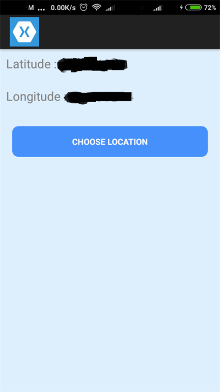
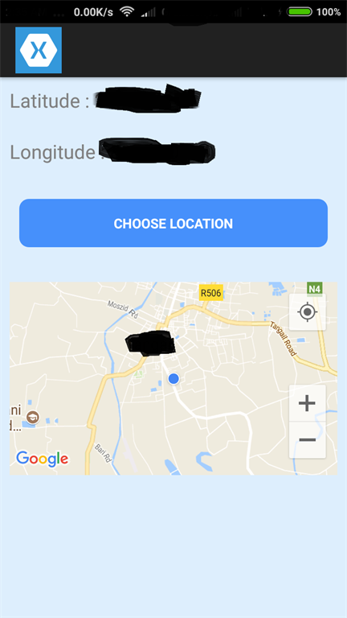
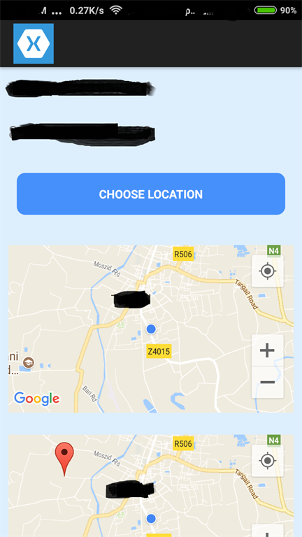

+++
author = "Safayat Borhan"
title = "Google Map In Xamarin.Forms"
date = "2017-10-19"
description = "Google Map In Xamarin.Forms"
tags = [
    "XAMARIN",
    "csharp",
    "Google Map",
    "Custom Map",
    "Geolocation"
]
+++

Google Maps Service is very popular in various enterprise-level mobile applications. I will discuss here how to use Google Maps in Xamarin.Forms and customize it using custom renderer for further functionality. So, let’s create a Xamarin.Forms project in Visual Studio under Visual C# and cross-platform, and name it as GoogleMapUsingXamarinForms.

Let’s start with the basics. First of all, we will see how to obtain the latitude and longitude using the mobile's GPS. And then, we will use the coordinates in the Google Maps to show the exact current location. In this project, we will use C# for both, design and coding.

First of all, let’s create a folder named ‘Pages’ in Portable Class Library (PCL) and add a class named GoogleMapScreen.cs. We have to include some NuGet Packages. Go to ‘Manage NuGet Packages For Solution’. Browse for ‘Xam.Plugin.Geolocator’ (Version 3.0.4). Install it in both, PCL and GoogleMapUsingXamarinForms.Droid, projects.

Then, right-click on the Android project and go to properties. Check the required permissions.

ACCESS_COARSE_LOCATION
ACCESS_FINE_LOCATION
ACCESS_MOCK_LOCATION
ACCESS_LOCATION_EXTRA_COMMANDS
INTERNET
ACCESS_WIFI_STATE
Then, in GoogleMapScreen.cs, write the following code. 
```csharp
class GoogleMapScreen : ContentPage  
{  
    public GoogleMapScreen()  
    {  
        GoogleMapScreenLayout();  
    }  

    #region initialize  
    Label lblLat = new Label();  
    Label lblLong = new Label();          
    #endregion  

    public void GoogleMapScreenLayout()  
    {  
        #region label latitude  
        lblLat = new Label  
        {  
            Text = "Lat",  
            FontSize = 20,  
            TextColor = Color.Gray  
        };  
        StackLayout slLblLat = new StackLayout  
        {  
            Children = { lblLat },  
            Orientation = StackOrientation.Horizontal,  
            Padding = new Thickness(10, 10, 10, 10)  
        };  
        #endregion  

        #region label longitude  
        lblLong = new Label  
        {  
            Text = "Long",  
            FontSize = 20,  
            TextColor = Color.Gray  
        };  
        StackLayout slLblLong = new StackLayout  
        {  
            Children = { lblLong },  
            Orientation = StackOrientation.Horizontal,  
            Padding = new Thickness(10, 10, 10, 10)  
        };  
        #endregion  

        #region button for current location  
        Button btnLatLong = new Button  
        {  
            Text = "Choose location",  
            HorizontalOptions = LayoutOptions.FillAndExpand,  
            BackgroundColor = Color.FromHex("4690FB"),  
            TextColor = Color.White,  
            BorderRadius = 10,  
            WidthRequest = 100,  
            HeightRequest = 50,  
            FontAttributes = FontAttributes.Bold  
        };  
        btnLatLong.Clicked += BtnLatLong_Clicked;  

        StackLayout slBtnLatLong = new StackLayout  
        {  
            Children = { btnLatLong },  
            Orientation = StackOrientation.Horizontal,  
            Padding = new Thickness(20, 20, 20, 20)  
        };  
        #endregion  

        #region stack layouts and contents  
        StackLayout slGoogleMapScreen = new StackLayout  
        {  
            Children = { slLblLat, slLblLong, slBtnLatLong },  
            HorizontalOptions = LayoutOptions.FillAndExpand,  
            VerticalOptions = LayoutOptions.FillAndExpand,  
            Padding = new Thickness(0, 0, 0, 0),  
            BackgroundColor = Color.FromHex("DDEEFD")  
        };  

        ScrollView svGoogleMapScreen = new ScrollView  
        {  
            Content = slGoogleMapScreen  
        };  

        Content = svGoogleMapScreen;  
        #endregion  
    }  

    private async void BtnLatLong_Clicked(object sender, EventArgs e)  
    {  
        await RetrieveLocation();  
    }  

    private async Task RetrieveLocation()  
    {  
        var locator = CrossGeolocator.Current;  
        locator.DesiredAccuracy = 20;  
        var position = await locator.GetPositionAsync(timeoutMilliseconds: 10000);  

        lblLat.Text = "Latitude : " + position.Latitude.ToString();  
        lblLong.Text = "Longitude : " + position.Longitude.ToString();  
    }  
} 
```

And also, we have to make some changes in App.cs.
```csharp
public class App : Application  
{  
    static NavigationPage navPage;  
    public App()  
    {  
        MainPage = FrontPage();  
    }  

    public static Page FrontPage()  
    {  
        navPage = new NavigationPage(new GoogleMapScreen());  
        return navPage;  
    }  
}  
```

After running the project on a real device, the output will look like this.


To implement this latitude and longitude in Google Maps, we need to obtain Google MapsAPIi key first. For that, we have to go to this page : https://console.developers.google.comhttps://console.developers.google.com

Then, create a new project here and name it “GoogleMapUsingXamarinForms”. Click “Enable API and Services”. On the next page, you will find a list of APIs. Click on “Google Maps Android API”. Enable it and click “Create Credentials”. Then, on the next page, click “What credentials do I need”. Then, click “Restrict Key”.

In the next page, you will find several radio buttons under key restrictions. As we will use this key for Android app, click the “Android apps” radio button and then click on “Add Package Name and Fingerprint” button. Here, there will be two fields you need to insert the data in. “Package name” and “SHA-1 Certificate Fingerprint”. For obtaining “SHA-1 Certificate Fingerprint”, you have to go to the directory where java jdk is installed. In my case, it was installed here : “C:\Program Files\Java\jdk1.8.0_131\bin”. Then open Command Prompt here, in this directory. Write this command 
keytool -list -v -keystore "C:\Users\USERNAME_OF_THE_MACHINE\AppData\Local\Xamarin\Mono for Android\debug.keystore" -alias androiddebugkey -storepass android -keypass android

If everything is all right, you will get data after pressing enter. Here you will find SHA-1 Certificate Fingerprint. Copy this and paste it in the “SHA-1 Certificate Fingerprint” field of the page. And for “Package name”, go to properties of “GoogleMapUsingXamarinForms.Droid”. Then go to Android Manifest. You will find Package name there. After filling the information correctly, save it. Now the api is ready for use. We will use this api into our project.

Now, let’s flip to our project. First of all, we need to install xamarin.forms.maps(version 2.3.2.127) form nuget in both PCL and GoogleMapUsingXamarinForms.Droid project. First initialize the map in initialize region:
```csharp
Map map = new Map();  
```

Then, add this code to make a map in the view screen. Then pass the stacklayout of the map into main stacklayout.
```csharp
map = new Map  
    {  
        WidthRequest = 320,  
        HeightRequest = 200,  
        IsShowingUser = true,  
        MapType = MapType.Street  
    };  
    StackLayout slMap = new StackLayout  
    {  
        Children = { map },  
        Orientation = StackOrientation.Horizontal,  
        Padding = new Thickness(10, 10, 10, 10)  
    };  
```

And write this code into button click.
```csharp
map.MoveToRegion(  
                MapSpan.FromCenterAndRadius(new Xamarin.Forms.Maps.Position(position.Latitude, position.Longitude)  
                , Distance.FromMiles(1)));  
```

Then, go to “AndroidManifest.xml” – which is in the properties of “GoogleMapUsingXamarinForms.Droid”. Here, in the Application segment, we have to define the api key, which we have obtained earlier
```xml
<application android:label="GoogleMapUsingXamarinForms" android:icon="@drawable/icon">  
    <meta-data android:name ="com.google.android.geo.API_KEY" android:value="YOUR_API_KEY"></meta-data>  
  </application>  
```
After building, run the application. If everything is all right, you will see the Google map pointing at your place after clicking the button.


Now, if we want to add some simple functionality into this Google map like, clicking over an area will show the latitude and longitude of the place. Then we won’t be able to make that in this map. In that case, we will need a custom map, that can be generated by custom renderer of xamarin.forms. To make that, let’s create a folder named “CustomRenderer” in both PCL and Android project. In PCL CustomRenderer, add a class named “CustomMapForClickEvent.cs”. And in Android CustomRendered, add a class named “CustomMapForClickEventRenderer.cs”.
```csharp
[assembly: ExportRenderer(typeof(GoogleMapUsingXamarinForms.CustomRenderer.CustomMapForClickEvent), typeof(CustomMapForClickEventRenderer))]  
  
namespace GoogleMapUsingXamarinForms.Droid.CustomRenderer  
{  
    public class CustomMapForClickEventRenderer : MapRenderer, IOnMapReadyCallback  
    {  
        private GoogleMap _map;  
  
        public void OnMapReady(GoogleMap googleMap)  
        {  
            _map = googleMap;  
            if (_map != null)  
                _map.MapClick += _map_MapClick;  
        }  
  
        protected override void OnElementChanged(ElementChangedEventArgs<Xamarin.Forms.View> e)  
        {  
            if (_map != null)  
                _map.MapClick -= _map_MapClick;  
            base.OnElementChanged(e);  
            if (Control != null)  
                ((MapView)Control).GetMapAsync(this);  
        }  
  
  
  
        private void _map_MapClick(object sender, GoogleMap.MapClickEventArgs e)  
        {  
            ((CustomMapForClickEvent)Element).OnTap(new Xamarin.Forms.Maps.Position(e.Point.Latitude, e.Point.Longitude));  
        }    }  
}  
```

CustomMapForClickEvent.cs
```csharp
namespace GoogleMapUsingXamarinForms.CustomRenderer  
{  
    public class CustomMapForClickEvent : Map  
    {  
        public event EventHandler<TapEventArgs> Tap;  
  
        public CustomMapForClickEvent()  
        {  
  
        }  
  
        public CustomMapForClickEvent(MapSpan region) : base(region)  
        {  
  
        }  
  
        public void OnTap(Position coordinate)  
        {  
            OnTap(new TapEventArgs { Position = coordinate });  
        }  
  
        protected virtual void OnTap(TapEventArgs e)  
        {  
            var handler = Tap;  
            if (handler != null) handler(this, e);  
        }  
    }  
  
    public class TapEventArgs : EventArgs  
    {  
        public Position Position { get; set; }  
    }  
} 
```

Then, in the design view, let’s make an instance of this custom map and use the tap event. First of all, initialize the custom map in the initialize region:
```csharp
ustomMapForClickEvent customMap = new CustomMapForClickEvent();
```

Then, add a new region for custom map writing necessary code and stacklayouts. Then add the stacklayout in the main stacklayout children.
```csharp
#region custom map  
customMap = new CustomMapForClickEvent  
{  
    WidthRequest = 320,  
    HeightRequest = 200,  
    IsShowingUser = true,  
    MapType = MapType.Street  
};  
customMap.Tap += CustomMap_Tap;  
StackLayout slCustomMap = new StackLayout  
{  
    Children = { customMap },  
    Orientation = StackOrientation.Horizontal,  
    Padding = new Thickness(10, 10, 10, 10)  
};  
#endregion  
  
private void CustomMap_Tap(object sender, TapEventArgs e)  
{  
    var latt = e.Position.Latitude;  
    var longg = e.Position.Longitude;  

    lblLat.Text = latt.ToString();  
    lblLong.Text = longg.ToString();  

    Pin pin = new Pin  
    {  
        Position = e.Position,  
        Label = "Position"  
    };  

    customMap.Pins.Add(pin);  
} 
```

And in the button click code, let’s add these lines.
```csharp
customMap.MoveToRegion(  
                MapSpan.FromCenterAndRadius(new Xamarin.Forms.Maps.Position(position.Latitude, position.Longitude)  
                , Distance.FromMiles(1)));  
```

That’s it. If we run the project and click button to choose location we will get the output like this. And we can also tap the second custom map to find the coordinate.


This article was previously published here before: https://www.c-sharpcorner.com/article/implementing-google-map-in-xamarin-forms/