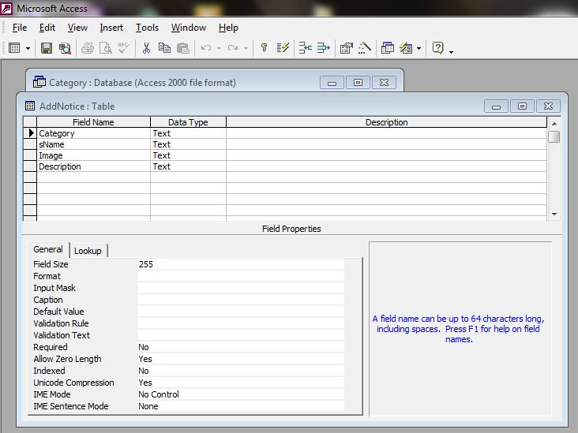
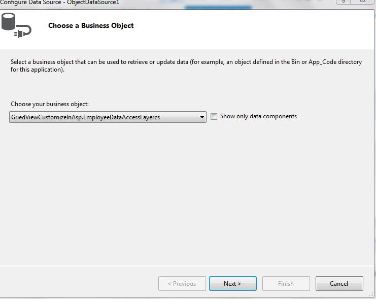
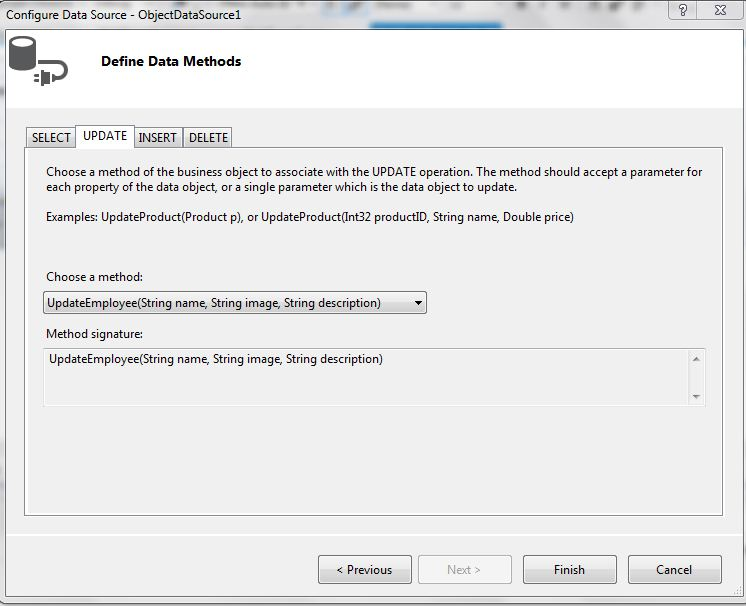

+++
author = "Safayat Borhan"
title = "ASP.NET WebForm GridView Customization"
date = "2015-08-09"
description = "GridView Customization in ASP.Net With OLEDB Database"
tags = [
    "GridView",
    "WebForm",
    "C#",
    "ASP.NET"
]
+++

In ASP.NET, GridView is one of the most useful tools for developers. Sometimes we need to customize a GridView for various purposes. It's not about visual customization. Assume you need to edit and delete a row from a GridView. What will you do then? Can you find these from the properties or can you get a built-in method from the Library? Or maybe you need to show some image in a column. How will you configure that? The fields generally support strings as far I know. So, you need to configure them to support image extensions so that an image can be shown.

So, here we go. Open Visual Studio and create a new empty web application project in ASP.Net. First of all, we need to make a class that can edit, delete and fetch data from a database. We will use Microsoft Access 2002 database here, so that we can overcome server problem issues. Before that, the database should be designed. If you don't have Microsoft Access 2002 then any version of Access beyond it wil work. Open Microsoft Access and create a blank database. Design it as in the following:


The database has been created. So now we need to create a webform to insert information into the table. Flip to Visual Studio and create a new empty webform. Make a GUI like this:


There are the four properties Category, Name, Image and Description. All are in string format, but what about images? Here is the trick. We will save the image in a folder within our project. Then we will send only the image location string to the database along with the other value. Then we will fetch the location from the database and insert them into the GridView. For that, make a folder in your project and name it "uploads". Also insert an App_Data folder into your project and copy the created dataset into the App_Data folder. Go to the saveButton code and start writing some C# code.
```csharp
protected void Button1_Click(object sender, EventArgs e)  
  
{
    try  
    {
        connection.Open();  
  
        if (FileUpload1.HasFile)
        {
            string str = FileUpload1.FileName;  
            FileUpload1.PostedFile.SaveAs(HttpContext.Current.Server.MapPath("~/uploads/") + str);  
            path = "~//uploads//" + str.ToString();  
        }
  
        string qry = "insert into AddNotice values ('" + TextBox1.Text + "','" + TextBox2.Text + "','" + path.ToString() + "','" + TextBox3.Text + "')";  
        OleDbCommand cmd = new OleDbCommand(qry, connection);  
        cmd.ExecuteNonQuery();  
        Label1.Text = "Data has been stored";  
    } 
    catch (Exception exp)  
    {  
        Response.Write(exp.ToString());  
    } 
    finally  
    {  
        connection.Close();  
    }
} 
```

We have inserted data into the database.


Now, make a class and name it "EmployeeDataAccessLayercs". In this class we will make three methods. One for edit, one for delete and another for showing all the information.
```csharp
public class Employee  
{  
    public string name  
    {  
        get;  
        set;  
    }  

    public string image  
    {  
        get;  
        set;  
    }  
    
    public string description  
    {  
        get;  
        set;  
    }  
}  
  
public class EmployeeDataAccessLayercs  
{  
    public static void UpdateEmployee(string name, string image, string description)  
    {  
        OleDbConnection connection = new OleDbConnection();  
        connection.ConnectionString = @  
        "Provider=Microsoft.Jet.OLEDB.4.0;Data Source=|DataDirectory|Category.mdb;";  
        connection.Open();  
        string qry = "update AddNotice SET sName = '" + name + "', Description = '" + description + "' where Image = '" + image + "'";  
        OleDbCommand cmd = new OleDbCommand(qry, connection);  
        cmd.ExecuteNonQuery();  
    }  
  
    public static void DeleteEmployee(string image)  
    {  
        OleDbConnection connection = new OleDbConnection();  
        connection.ConnectionString = @  
        "Provider=Microsoft.Jet.OLEDB.4.0;Data Source=|DataDirectory|Category.mdb;";  
        connection.Open();  
        string qry = "delete from AddNotice where Image = '" + image + "'";  
        OleDbCommand cmd = new OleDbCommand(qry, connection);  
        cmd.ExecuteNonQuery();  
    }  
  
    public static List < Employee > GetAllEmployees()  
    {  
        List < Employee > listEmployee = new List < Employee > ();  
        OleDbConnection connection = new OleDbConnection();  
        connection.ConnectionString = @  
        "Provider=Microsoft.Jet.OLEDB.4.0;Data Source=|DataDirectory|Category.mdb;";  
        connection.Open();  
        string qry1 = "select sName,Image,Description from AddNotice";  
        OleDbCommand cmd = new OleDbCommand(qry1, connection);  
        OleDbDataReader rdr = cmd.ExecuteReader();  
  
        while (rdr.Read())  
        {  
            Employee employee = new Employee();  
            employee.name = rdr[0].ToString();  
            employee.image = rdr[1].ToString();  
            employee.description = rdr[2].ToString();  
            listEmployee.Add(employee);  
        }  
  
        connection.Close();  
        return listEmployee;  
    }  
  
} 
```

Create another webform. Drag and drop a GridView and a ObjectdataSource. Click on configure data source in object data source. A new window will open.


Select “EmployeeDataAccessLayercs” from the drop down and click next. This window will open.


Select the method carefully from the drop down list for SELECT, UPDATE and DELETE that we have created in the “EmployeeDataAccessLayercs” class. Then click Finish. Now click on the GridView and change the data source from none to ObjectDataSource1. Then check the enable editing and enable deleting options.

Now, click on the GridView and flip to source mode. To enable the editing and deleting options, we need to define a DataKeyNames. Write DataKeyNames=”Image” and AutoGenerateColumns=”False”. Since we need to show an image in the GridView, we need to override the template fields of Name, Image and Description. Delete all the code from the Column field and write some new code. Have a look at here:
```xml
<Columns>  
    <asp:CommandField ShowDeleteButton="True" ShowEditButton="True" />  
    <asp:TemplateField HeaderText="name" SortExpression="name">  
        <EditItemTemplate>  
            <asp:TextBox ID="TextBox1" runat="server" Text='<%# Bind("name") %>'>  
            </asp:TextBox>  
        </EditItemTemplate>  
        <ItemTemplate>  
            <asp:Label ID="Label1" runat="server" Text='<%# Bind("name") %>'>  
            </asp:Label>  
        </ItemTemplate>  
    </asp:TemplateField>  
    <asp:TemplateField HeaderText="image" SortExpression="image">  
        <EditItemTemplate>  
            <asp:Image ID="TextBox2" runat="server" ImageUrl='  
                <%# Eval ("Image") %>' Height="50" Width="50" />  
        </EditItemTemplate>  
        <ItemTemplate>  
            <asp:Image ID="TextBox2" runat="server" ImageUrl='  
                <%# Eval ("Image") %>' Height="100" Width="100" />  
            </ItemTemplate>  
        </asp:TemplateField>  
        <asp:TemplateField HeaderText="description" SortExpression="description">  
            <EditItemTemplate>  
                <asp:TextBox ID="TextBox3" runat="server" Text='<%# Bind("description") %>'>  
                </asp:TextBox>  
            </EditItemTemplate>  
            <ItemTemplate>  
                <asp:Label ID="Label3" runat="server" Text='<%# Bind("description") %>'>  
                </asp:Label>  
            </ItemTemplate>  
        </asp:TemplateField>  
</Columns> 
```

We must redefine the template mode for all the three properties Name, Image and description.


This is how to configure a GridView depending on our own requirements. The code has been given to you. I hope this will help you much.

Thank you.

This article was previously published here before: https://www.c-sharpcorner.com/UploadFile/3bff37/gridview-customization-in-Asp-Net-with-oledb-database/