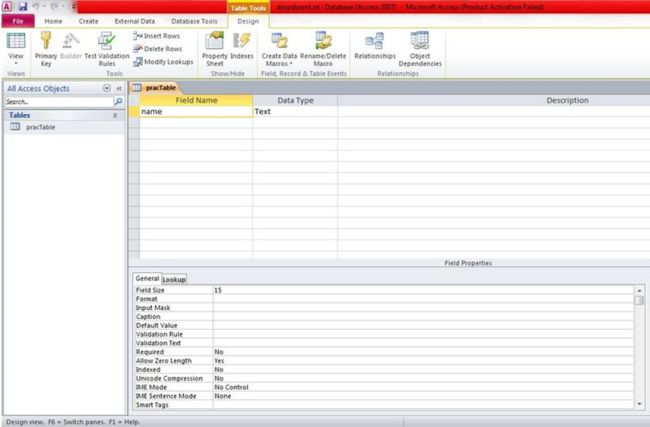

+++
author = "Safayat Borhan"
title = "Populate ASP.NET Dropdownlist by Local DB"
date = "2015-06-09"
description = "Populate ASP.NET Dropdownlist by Local DB"
tags = [
    "ASP.NET",
    "csharp",
    "Dropdownlist",
    "LocalDB",
    "Microsoft Access"
]
+++

Sometimes we cannot use SQL Server or MySQL with our application because of server problems and data traffic errors in various servers. In that case, if you use Access for the database for your application or web form, it will be less complicated for your application and will reduce server error problems. So, I will show you how to retrieve data and process it by accessing the database with an ASP.NET application. If you use an Access database, there will be no need to install a database engine into another computer to use your application. If there is Microsoft Office installed then you will get no error and can work smoothly thereafter.

First of all, you need to be familiar with Access databases. The process is pretty straight forward. Open your Microsoft Access, create a blank database and name it.


Right-click on the table and click on design view. Here you can define the column name and data type of each column. You can also change the field size. And obviously you can specify whether it is a primary key or not.


Now go to Visual Studio. Create an empty webform and make a GUI as in the following.


We will add some data into the Access database and will insert the data into a DropDownList. First of all, we need to be familiar with the Access database connection string. The connection string will be like the following:
```csharp
connection.ConnectionString = @"Provider=Microsoft.ACE.OLEDB.12.0;Data Source=(location of the file);  
Persist Security Info=False;"; 
```

The location is the following: C:\Documents\database.accdb.

For using the Access database, you need to import the OLEDB package of ADO.NET. So, don't forget to write using System.Data.OleDb;

The queries are nearly the same as SQL Server. If we click on the button, then the data will be inserted into the table of the database and that data from the column will be automatically inserted into the DropDownList using OleDbDataReader.
```csharp
protected void Button1_Click(object sender, EventArgs e)  
{  
   try  
   {  
      connection.Open();  
      string command = "insert into pracTable(name) values('" + TextBox1.Text + "') ";  
      OleDbCommand cmdd = new OleDbCommand(command, connection);  
      cmdd.ExecuteNonQuery();  
      Label1.Text = "Data inserted";  
   }  
   catch (Exception exp)  
   { }  
   finally  
   {  
      connection.Close();  
   }  
} 
```

And in the page load function, we will initialize an OleDbDataReader. Then we will make a loop for retrieving the data from that column (name) and insert them to the dropdown list.
```csharp
if (!IsPostBack)  
{  
   OleDbDataReader myReader;  
   string command2 = "select * from pracTable";  
   OleDbCommand cmd2 = new OleDbCommand(command2, connection);  
   myReader = cmd2.ExecuteReader();  
   while (myReader.Read())  
   {  
      string sName = myReader.GetString(0);  
      Label1.Text = sName;  
      DropDownList1.Items.Add(sName);  
   }  
} 
```

The process is pretty straight forward. I am giving the code and the database. Please remember that if you want to run this on your machine, provide your specific database path into the connection string.

This article was previously published here before: https://www.c-sharpcorner.com/UploadFile/3bff37/insert-data-into-access-database-and-retrieve-them-into-drop/