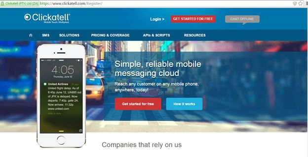
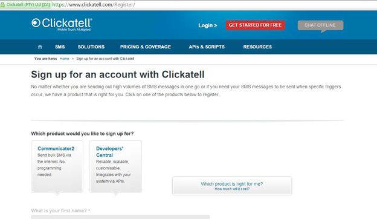
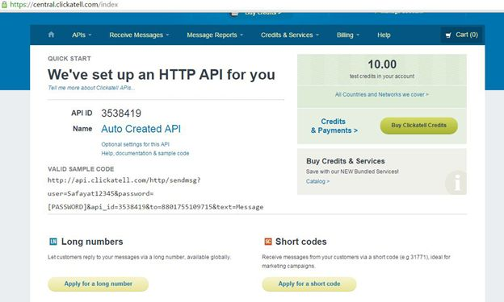
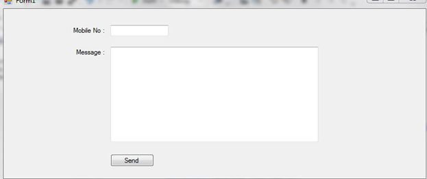
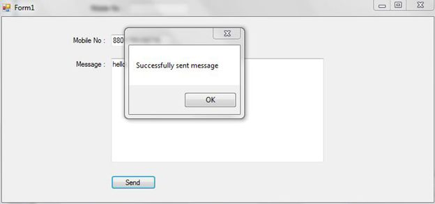

+++
author = "Safayat Borhan"
title = "Send SMS from WinForm Application"
date = "2015-04-23"
description = "Send SMS from WinForm Application"
tags = [
    "WinForm",
    "csharp",
    "SMS",
    "Clickatell"
]
+++

For sending SMS messages from your Windows or web form application you will need a web API. There are some websites for API purchase. Some websites provide an API for free. Here I will show you how to use them and sending messages to a mobile network using the API.

## Step 1
I have used a web API from www. clickatell.com. The process is pretty straight forward. First of all, you need to register in the website.


Click on, “GET STARTED FOR FREE”.


Click on, “Developers' Central”. And provide the basic information during the registration process. After completing the registration, a mail will be sent by them to your E-Mail address. Like this:


Here they will give you a Client ID for the API. Click on the “click here” link. They will automatically give you the string for sending the message using the API.


Copy the sample code and save it.

## Step 2
Open your Visual Studio and create a Windows Forms application project and name it. Here is mine:


The code behind this scenario is pretty cool. You just need the code they have given you. For using the API, you need to make an object of the WebClient class. And using this object, all the web APIs can be used under specific conditions. For the WebClient class you need to import a library writing “Using System.Net” at the field level. Here is the button click code:

```csharp
try   
{  
    WebClient client = new WebClient();  
    string to, message;  
    to = textBox1.Text;  
    message = textBox2.Text;  
    string baseURL = "http://api.clickatell.com/http/sendmsg?user=zisan94268&password=OYeNLVUHTNIHbD&api_id=3528011&to='" + to + "'&text='" + message + "'";  
    client.OpenRead(baseURL);  
    MessageBox.Show("Successfully sent message");  
}   
catch (Exception exp)  
{  
    MessageBox.Show(exp.ToString());  
}  
```

Remember, the baseURL string is the same as they have provided. You need to replace the User Name, Password and API ID.


If everything is OK, then the message will be sent to the number you inserted.

Thank you for reading.

Have a nice day.

This article was previously published here before: https://www.c-sharpcorner.com/UploadFile/3bff37/sending-sms-via-windows-form-application/